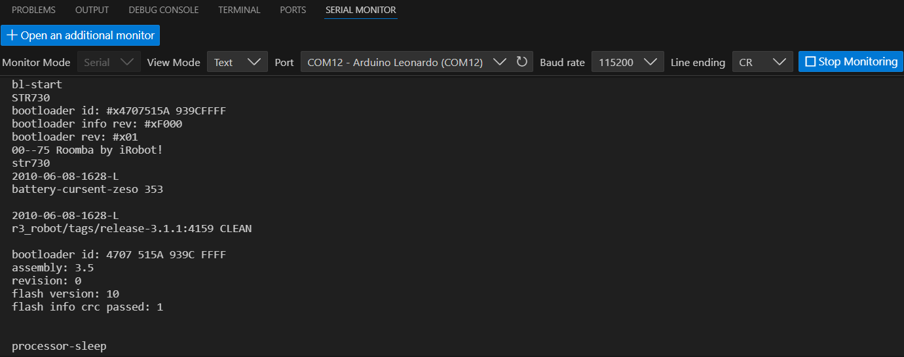
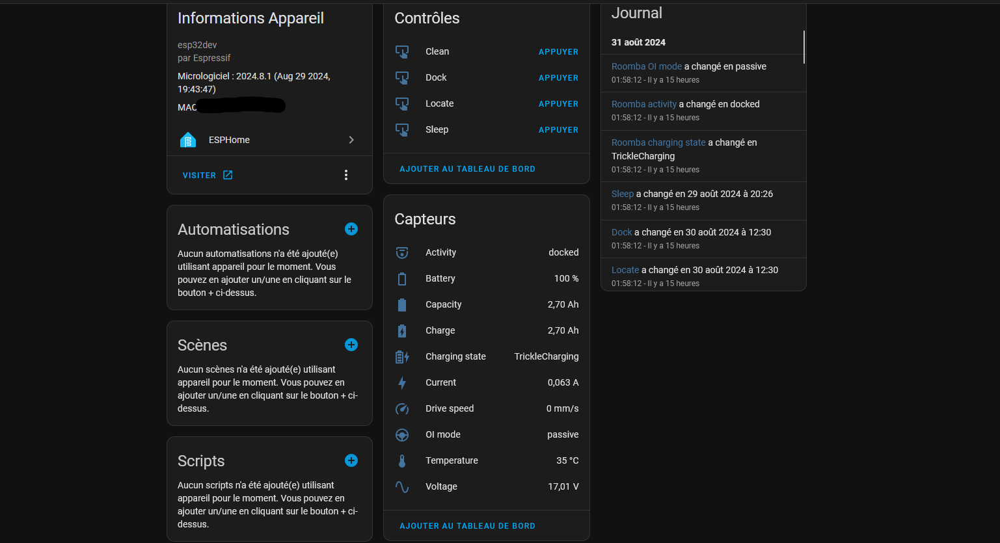

## Integrating home automation into a 16-year-old product
The Roomba is one of the first robot vacuum cleaners, marketed in 2002. This technology was revolutionary for its time and quite expensive. Nowadays, many manufacturers offer Wi-Fi-connected robot vacuums with countless features. I remember that we had one of these robots when I was little. After searching a bit, I found it under stacked boxes.

This robot is the Roomba 551, which was marketed in 2008 and brought automatic cleaning scheduling at the time. When trying to charge it, nothing happens. I disassemble it and find a completely rusted and flat battery. I decide to order another one and notice a DIN7 port on the top of the device.


*Roomba's DIN7 port.*

After doing some research, I come across a whole documentation for programming and modifying the firmware, this program is called iRobot Roomba Open Interface (http://www.robotikasklubs.lv/read_write/file/Piemers/iRobot_Roomba_500_Open_Interface_Spec.pdf).


*Pin map of DIN7 port in iRobot Roomba Open Interface*

Everything is described there, the specifications of serial communication, the control opcodes of the device, the weight, speed, sensors, everything. Only one thing comes to mind, it's to connect this Robot vacuum to Home Assistant. I just need to integrate a solution with a Wi-Fi microcontroller.

## Choice of microcontroller and wiring diagram
The first choice for a microcontroller with Wi-Fi capabilities is the ESP, and more specifically the ESP32. It's currently the simplest, most complete, and cheapest platform. We find it on all home automation devices, in different forms, but it remains the same chip. I opt for an ESP32-WROOM module at €2.

This ESP module requires a 5V power supply, however, none of the DIN7 port pins provide this. One port provides direct power from the battery. It indicates a voltage of 14.4V, but it's obvious that a battery's voltage varies with its charge. That's why I chose a DC-DC buck converter to simply reduce the voltage, whether it's 14V or 11V to 5V for the ESP32. The wiring will be as follows:


*Wiring diagram of the ESP and buck converter*

The BRC pin will allow turning on the Roomba if it turns off. It's the only way to wake it up besides physically pressing the button.

## Debug and serial communication tests
Before wiring, I decide to simply test the serial communication using a platform I know better: Arduino. From our first year of BUT GEII, we were able to design an Arduino Leonardo board in CAD and solder its components.


*This board is pretty nice!*

This board allows the use of two hardware serial ports at the same time, which is simpler and more convenient for testing the robot. With a simple multiserial configuration, I wire it and get a small message from my robot:


*Apparently it's stuck in 2010...*
 
I decide to go further and look for pre-existing work on the Roomba in Arduino. I come across this Github repo (https://github.com/pkyanam/ArduRoomba) and everything is there. All the commands and associated opcodes. I then try the Start command (Serial com initialization), Safe (Roomba Safe Mode) then Clean (Cleaning Mode), and the robot starts a cleaning cycle. It's wonderful!

I finally decide to wire my ESP, this wiring is temporary until the solution works:


*Yes, it's not very neat for now.*

## ESPHome, a simple and powerful framework
ESPHome is a framework that allows programming ESP microcontrollers very simply and integrating them into pre-existing home automation systems. For me, it will be Home Assistant.

To install ESPHome on Home Assistant, I go to **Add-ons / Store / ESPHome**. Once the module is installed, we arrive on a page allowing to add a device with **New Device**. From there, everything is guided. You just need to install ESPHome as well as a Wi-Fi configuration on a microcontroller connected via USB. Once that's done, there's no need to connect the device anymore and updates can be done OTA (Over The Air).

The configuration file allows directly integrating code on the device and linking with Home Assistant entities. My first configuration file uses the UART function of ESPHome to communicate with the robot:

### First config: Command only
```yaml
# ESPHome Config
esphome:
  name: roombaesp
  friendly_name: roombaesp

esp32:
  board: esp32dev
  framework:
    type: arduino

# For security reasons, Wifi and API configs have been removed

# UART Initialization
uart:
  baud_rate: 19200 
  tx_pin: GPIO1 
  rx_pin: GPIO3
  stop_bits: 1   
       
output:
  - platform: gpio
    id: brc_pin
    pin: GPIO21 
    inverted: false

# Roomba Commands
switch:
  - platform: template
    name: "Setup"
    turn_on_action:
      then:
        - output.turn_on: brc_pin  
        - delay: 2s  
        - repeat:
            count: 3
            then:
              - output.turn_off: brc_pin 
              - delay: 100ms
              - output.turn_on: brc_pin  
              - delay: 100ms
        - uart.write: [128]  
        - delay: 100ms
        - uart.write: [131] 
  - platform: template
    name: "Clean"
    turn_on_action:
      - uart.write: [135]
  - platform: template
    name: "Power"
    turn_on_action:
      - uart.write: [133]  
  - platform: template
    name: "Base"
    turn_on_action:
      - uart.write: [143]  
  - platform: template
    name: "Start"
    turn_on_action:
      - uart.write: [128] 
  - platform: template
    name: "Safe"
    turn_on_action:
      - uart.write: [131]  
```
This configuration works, but no feedback from the robot is available. It's possible to write a piece of code to retrieve each piece of information, but luckily, this has already been done by the ESPHome community (see https://community.home-assistant.io/t/add-wifi-to-an-older-roomba/23282). I just need to combine my code and that of this github repo on the UART branch (https://github.com/davidecavestro/ESPHomeRoombaComponent/tree/uart) to have both sensors and commands!

### Second config: Command and sensors
```yaml
# ESPHome Config and Libraries
esphome:
  name: "roomba"
  platform: esp32
  board: esp32dev

  includes:
    - ESPHomeRoombaComponent.h
  libraries:
    - EspSoftwareSerial
    - Roomba=https://github.com/davidecavestro/Roomba.git
  
substitutions:
  friendly_name: "Roomba"
  # BRC pin, RX pin, TX pin, polling interval in milliseconds
  # Pin 3 is labeled rx on the wemos d1 mini, 1 is labeled TX We don't use the hardware UART but we're using its pins!
  init: 'RoombaComponent::instance(21, id(uart_bus), 8000, false);'

# For security reasons, Wifi and API configs have been removed

# UART Initialization
uart:
  id: uart_bus
  tx_pin: GPIO1
  rx_pin: GPIO3
  baud_rate: 115200
  
# Enable logging
logger:
  hardware_uart: UART1

# Roomba Sensors

custom_component:
  - lambda: |-
      auto r = ${init}
      return {r};

sensor:
  - platform: custom
    lambda: |-
      auto r = ${init}
      return {r->voltageSensor, r->currentSensor, r->batteryChargeSensor, r->batteryCapacitySensor, r->batteryPercentSensor, r->batteryTemperatureSensor, r->driveSpeedSensor};

    sensors:
      - name: "${friendly_name} voltage"
        unit_of_measurement: "V"
        icon: mdi:sine-wave
        accuracy_decimals: 2
        filters:
        - quantile:
            window_size: 7
            send_every: 4
            send_first_at: 3
            quantile: .9
        - multiply: 0.001

      - name: "${friendly_name} current"
        unit_of_measurement: "A"
        icon: mdi:lightning-bolt
        accuracy_decimals: 3
        filters:
        - quantile:
            window_size: 7
            send_every: 4
            send_first_at: 3
            quantile: .9
        - multiply: 0.001

      - name: "${friendly_name} charge"
        unit_of_measurement: "Ah"
        icon: mdi:battery-charging
        accuracy_decimals: 2
        filters:
        - quantile:
            window_size: 7
            send_every: 4
            send_first_at: 3
            quantile: .9
        - multiply: 0.001

      - name: "${friendly_name} capacity"
        unit_of_measurement: "Ah"
        icon: mdi:battery
        accuracy_decimals: 2
        filters:
        - quantile:
            window_size: 7
            send_every: 4
            send_first_at: 3
            quantile: .9
        - multiply: 0.001

      - name: "${friendly_name} battery"
        unit_of_measurement: "%"
        state_class: "measurement"
        device_class: battery
        icon: mdi:battery-outline
        accuracy_decimals: 0
        filters:
        - quantile:
            window_size: 7
            send_every: 4
            send_first_at: 3
            quantile: .9

      - name: "${friendly_name} temperature"
        unit_of_measurement: "°C"
        icon: mdi:thermometer
        accuracy_decimals: 0
        filters:
        - quantile:
            window_size: 7
            send_every: 4
            send_first_at: 3
            quantile: .9

      - name: "${friendly_name} drive speed"
        unit_of_measurement: "mm/s"
        icon: mdi:speedometer
        accuracy_decimals: 0

text_sensor:
  - platform: custom
    lambda: |-
      auto r = ${init}
      return {r->chargingSensor, r->activitySensor, r->oiModeSensor};
    text_sensors:
        - name: "${friendly_name} charging state"
          icon: mdi:battery-charging-high 
        - name: "${friendly_name} activity"
          icon: mdi:robot-vacuum-variant
        - name: "${friendly_name} OI mode"
          icon: mdi:steering

# Roomba Commands

button:
  - platform: template
    name: "Locate"
    on_press:
      lambda: |-
        auto r = ${init}
        r->on_command("locate");
  - platform: template
    name: "Dock"
    on_press:
      lambda: |-
        auto r = ${init}
        r->on_command("dock");
  - platform: template
    name: "Clean"
    on_press:
      lambda: |-
        auto r = ${init}
        r->on_command("start");
  - platform: template
    name: "Sleep"
    on_press:
      lambda: |-
        auto r = ${init}
        r->on_command("sleep");
```
Everything works perfectly and everything is available on Home Assistant:



## Home Assistant Template and Voice Assistants
Now, I want to make my device appear as a robot vacuum cleaner. This will allow integration with services like Apple Homekit or Google Assistant. For this, nothing could be simpler, I just need to make a **Vacuum Template** on Home Assistant. The objective is simply to take the ESP32 entities and associate them with each feature of a robot vacuum cleaner entity:

```yaml
vacuum:
  - platform: template
    vacuums:
      roomba:
        value_template: "{{ states('sensor.roomba_activity')|lower }}"
        battery_level_template: "{{ states('sensor.roomba_battery')|int }}"
        attribute_templates:
          activity: "{{ states('sensor.roomba_activity') }}"
          oi_mode: "{{ states('sensor.roomba_oi_mode')|title }}"
          charging_state: "{{ states('sensor.roomba_charging_state') }}"
          temperature: "{{ states('sensor.roomba_temperature')|int }} °C"
          voltage: "{{ states('sensor.roomba_voltage')|int }} V"
        start:
          service: button.press
          target:
            entity_id: button.clean
        stop:
          service: button.press
          target:
            entity_id: button.locate
        return_to_base:
          service: button.press
          target:
            entity_id: button.dock
```
We now have our device that is ready to be integrated with voice assistants:


*Mission accomplished!*

All that's left is to wait for the Apple Homekit update later this year for robot vacuum support. :)
