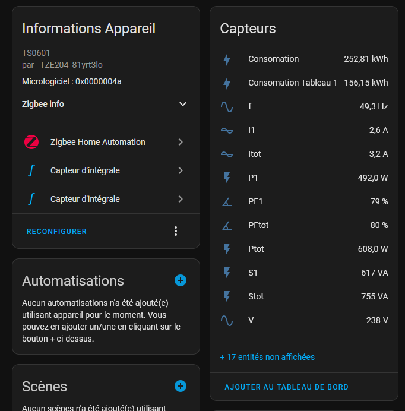
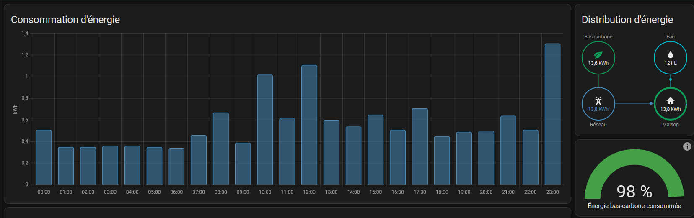

## Home Assistant, a must-have for home automation?
Over the past few years, Home Assistant has really established itself among home automation environments. Its efficiency, compatibility and huge community have propelled it ahead of other open source solutions such as Jeedom. 

Having tried out Home Assistant a few months ago, I realized that not only was my entire home automation installation compatible, but that new devices could also be integrated. All that remained was to configure a clean, sustainable solution within Home Assistant.

Most users recommend lightweight devices such as the Raspberry Pi from model 3 upwards to run the home automation server. However, in my case, I thought of an even simpler solution: what if I ran it on my internet box? 

The Freebox ultra is Free's new box equipped with the Qualcomm IPQ 9574 SoC, i.e. four ARM Cortex-A73 cores clocked at 2.2GHz, which places it between the Raspberry Pi 4 and 5 in terms of performance. It supports VMs (virtual machines) and USB peripherals, which is very useful for Zigbee devices. All I have to do is plug in a Zigbee key and launch the VM to control all my devices: air conditioners, sensors, lighting...


*The Freebox VM window.*

## Monitoring power consumption
### Zigbee meter installation
One of Home Assistant's major assets is its ability to manage energy consumption and solar installations. With just a few data, it's possible to set up an entire monitoring dashboard (see https://www.home-assistant.io/home-energy-management/ ). Initially, I'd like to focus on electricity consumption. For this, I have three solutions:

 - Use of the Linky meter (communicating meter from distributor Enedis) via the Enedis API (Cloud, see https://github.com/bokub/ha-linky )
 - Use of the local Linky meter via a TIC module
 - Installation of an additional Zigbee meter

 I opted for the last solution, as it seemed the cheapest, but also allowed me to compare the data with that of the Linky cloud. A simple Zigbee device obtainable on AliExpress for around twenty euros would be more than enough. 

[Price of sensor on AliExpress](image-1.png)
*At that price, I don't expect much... But I'll be pleasantly surprised!*

This one is rated for 80 A maximum, which is more than enough. It has two transformers (current collectors) for two channels, which will enable me to differentiate my two electrical panels. Installation is straightforward: just connect it to the mains and loop the two current sensors (see photo below):


[Electrical assembly](image-22.png)
*Red on red and blue on blue.*

The sensor lights up with both probes properly installed. All I need to do now is configure it.

### Home Assistant configuration
First of all, the device isn't fully plug and play; the data is present but raw and unformatted. Fortunately, the Home Assistant community is large enough to have produced a ZHA quirk, which is simply a formatting file for Zigbee Home Assistant (see https://forum.hacf.fr/t/zigbee2mqtt-et-probleme-avec-compteur-energie-tuya-zigbee/29847 ). Once the file has been integrated, our consumption data is displayed:


*But what am I gonna do with all this data?*

All that's left is to use the mathematical integration templates to switch from instantaneous power to consumption in kWh (see https://www.home-assistant.io/integrations/integration/ ). This consumption can be directly integrated into the Energy tab of Home Assistant:


*This looks great, doesn't it?*

This data corresponds to the Zigbee sensor, and the decarbonized energy rate is taken directly from the Electricity Maps API (great site to check out here: https://app.electricitymaps.com/map ).

For fun, I've also integrated data from the Linky cloud to compare consumption, and the results are quite surprising:


*Obviously, Linky is higher...*

Firstly, the Zigbee sensor is very similar to the Linky sensor, despite its low price! Secondly, the differences are almost constant, suggesting that upstream consumption is not taken into account. The Linky meter consumes between 2 and 10W, and is the only upstream device. This discrepancy is either an offset sensor calibration error (constant), or an unidentified device in my electrical installation. The mystery remains unsolved to this day... (big doubts about this sensor though).

## Monitoring water consumption
### How do I do it?
Power consumption monitoring is simple and non-intrusive. No wiring had to be modified. Monitoring water consumption is much more complicated. Although there are devices to do this, the piping has to be modified, and my plumbing skills are almost non-existent. The same problem applies to monitoring gas consumption.

Then there are communicating meters like Linky, or GRDF's Gazpar meter, for example. It's either possible to install a mod like the TIC module, or to use the suppliers' cloud API directly. However, I've found an even simpler solution for my situation, and it starts with the discovery of a very strange Wi-Fi network...

### A very strange WI-FI network...
While wandering around the beaches and Zigbee channels (who doesn't do that?), I noticed a very strange network. It was called BWT@7642 and was particularly close. A Google search tells me that BWT is a manufacturer of water treatment products; I immediately make the connection with my softener. This one is indeed from BWT, but what is a Wi-Fi network doing on this machine? 

BWT offers home automation solutions for water softeners, but mine isn't one of them. So what's the point of a Wi-Fi network (and Bluetooth for that matter) on a softener? I log on and come across this page:

[Water softener home page](image-2.png)
*Water softener home page*

I've got some maintenance information, which will be very useful. Let's see how requests for this information are handled:

[HTTP requests](image-8.png)
*Slow down on requests!*

Every second, a script sends a get request to a link (http://192.168.1.72/cgi-bin/getinfo1) and the device returns a JSON string:

```json
{
  "remRege":2000,
  "remCapa":42,
  "remSalt":7000,
  "waterCons":645,
  "waterRege":0,
  "alarme":0,
  "etat":0,
  "error":0
}
```
You'll notice that there's more information than on the page itself, especially on water consumption. Knowing that all water goes through the softener, we'll have direct information on water consumption in the home.

What's more, this data concerns total volume, not actual flow. By way of analogy, with electricity consumption, we used to have instantaneous power rather than energy consumed, but now we have water consumed rather than flow rate. This will make it easier to integrate into Home Assistant's energy tab.

### Home Assistant configuration

Knowing that we have a JSON string on an address, all we need is a Home Assistant integration that can make HTTP requests. It exists and is called RESTful, based on the REpresentational State Transfer or REST API, which enables data communication between machines. Here's my YAML configuration:

```yaml
rest:
  - authentication: basic
    scan_interval: 10
    resource: http://192.168.1.72/cgi-bin/getinfo1
    sensor:
      - name: "Remaining Rege"
        json_attributes_path: "$"
        value_template: '{{ value_json.remRege }}'
        unit_of_measurement: "g"
        state_class: "measurement"
        device_class: "weight"
        json_attributes:
          - remRege
      - name: "Remaining Capacity"
        json_attributes_path: "$"
        value_template: '{{ value_json.remCapa }}'
        unit_of_measurement: "kg"
        state_class: "measurement"
        device_class: "weight"
        json_attributes:
          - remCapa
      - name: "Remaining Salt"
        json_attributes_path: "$"
        value_template: '{{ value_json.remSalt }}'
        unit_of_measurement: "g"
        state_class: "measurement"
        device_class: "weight"
        json_attributes:
          - remSalt
      - name: "Water Consumption 2"
        json_attributes_path: "$"
        value_template: '{{ value_json.waterCons }}'
        unit_of_measurement: "L"
        state_class: "total_increasing"
        device_class: "water"
        json_attributes:
          - waterCons
      - name: "State"
        json_attributes_path: "$"
        value_template: '{{ value_json.etat }}'
        state_class: "measurement"
        json_attributes:
          - etat
      - name: "Error"
        json_attributes_path: "$"
        value_template: '{{ value_json.error }}'
        state_class: "measurement"
        json_attributes:
          - error
      - name: "Water Regeneration"
        json_attributes_path: "$"
        value_template: '{{ value_json.waterRege }}'
        state_class: "measurement"
        json_attributes:
          - waterRege
      - name: "Alarm"
        json_attributes_path: "$"
        value_template: '{{ value_json.alarme }}'
        state_class: "measurement"
        json_attributes:
          - alarme
```

Each time, we assign a sensor to a JSON attribute, specifying the nature of the sensor, its class and unit. This allows the sensor to be directly integrated into the Home Assistant energy tab:

[Histogram of water consumption](image-9.png)
*With the shower, it goes up very quickly!

The other sensors I've set up will give me information on remaining salt and potential problems with the softener.

## Dashboard monitoring
Using Home Assistant to control my home automation devices, I already have a dashboard. All I need to do now is integrate the consumption section into it.

[Home Dashboard](image-10.png)
*Cool, isn't it?*

In this dashboard, you'll find the consumption (water and electricity) for the day and the instantaneous consumption. As we saw earlier, it's easy enough to switch between instantaneous and total values, using Home Assistant's mathematical operators for derivation and integration.

For daily consumption, I'll simply reuse the maps from Home Assistant's energy tab (see https://www.home-assistant.io/dashboards/energy/ ). For instantaneous consumption, a custom map will be used (see https://github.com/flixlix/power-flow-card-plus ). After a few minutes of configuration, I arrive at this result:


*1.2 kW ?! I think the oven is on.*

We have instantaneous and even split consumptions for both tables, consumptions per day and histograms per hour.

## What's next?
This consumption monitoring dashboard has enabled us to identify the consumption of appliances, particularly those on standby, and to raise our awareness of the cost of resources. When electricity consumption is a basic 300W, there's real work to be done on the efficiency of appliances that are constantly on, I'm thinking in particular of refrigerators and VMCs.

I still have a lot of work to do, especially on integrating the softener and the various alarms. I need to think about implementing it in an interface. I haven't mentioned gas consumption either. Although there's a communicating meter (Gazpar), I'll need to study the subject a bit more to come up with a concrete, sustainable solution.

