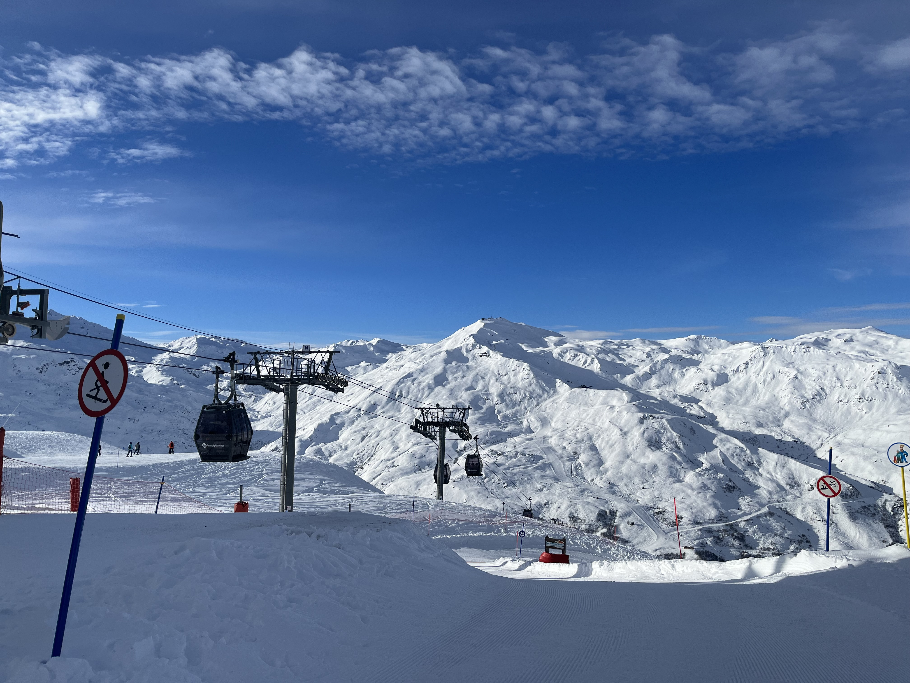

Je m'apelle Redwan Benmansour et je suis étudiant en Génie Électrique et Informatique Industrielle (GEII). La technologie a toujours été pour moi une passion. Cette passion est nourrie à la fois par ma curiosité, mais surtout par mon envie de me rendre utile aux autres et d'améliorer la vie de chacun.

### IUT de l'Indre : Site de Châteauroux
J'ai grandi à Châteauroux, une petite ville dans laquelle j'ai eu la chance de trouver l'IUT de l'Indre. J'ai connu cet IUT depuis tout petit, j'y allais tous les ans lors de la fête de la science. J'y découvrais les projets et les innovations des étudiants et des enseignants-chercheurs du département de GEII. 

*Moi-même accompagné par ma mère à la fête de la science du 13 octobre 2012.*

La proximité de l'IUT de l'Indre a été un avantage considérable du fait à la fois de promotions à taille réduite et de proximité avec les enseignants. C'est grâce à cela que j'ai pu développer mes compétences et me professionnaliser lors de projets de groupes ambitieux. L'IUT de l'Indre est surtout un lieu étudiant dans lequel les trois années de GEII s'entraident et travaillent ensemble. C'est dans cet esprit que je souhaite poursuivre mes études supérieures.

### Un cursus en accord avec ma vision du monde
Les enjeux environnementaux actuels sont un défi immense dont notre génération doit faire face. Le parcours EME me permet de me spécialiser en énergies renouvelables et vers des techniques d'amélioration des rendements énergétiques. Différents projets nous permettent de développer nos compétences. Ces projets ont été par exemple l'installation d'une ombrière photovoltaïque ou encore l'étude d'un système de filtrage actif. Nous apprenons le développement et la mise en place de ces systèmes, sur des cas concrets et avec une grande diversité de matériel professionnel. Vous trouverez sur ce blog les moments forts de ces projets.

Ce parcours me permet de développer des compétences techniques tout en étant en harmonie avec mon projet personnel, qui est de faire face aux enjeux climatiques et énergétiques en apportant des solutions techniques concrètes. Il est vrai que la situation climatique est angoissante, mais voir ce dont la communauté scientifique est capable de faire est rassurant et nous donne de l'espoir, notamment par des projets tels que le réacteur à fusion nucléaire de l'ITER. Nous avons le pouvoir de changer les choses et de contribuer à un monde meilleur.

### L'activité sportive au centre de mes études
Mon lieu d'études me permet également de pratiquer une activité sportive, comme la natation au centre aquatique Balsan'eo. Le sport est pour moi une activité très importante dans l'équilibre de ma charge mentale ; il me permet de prendre une pause pour mieux aborder certains projets ou travaux. Le sport me permet aussi simplement d'être en bonne santé physique. 

D'autres événements étudiants comme le séjour au ski sont organisés tous les ans et permettent la cohésion des groupes au travers d'activités sportives. Par ailleurs, le séjour au ski permet à de nombreux étudiants de découvrir les paysages magnifiques des Alpes.

*Séjour au ski de janvier 2024 aux Menuires, Les 3 Vallées.*

