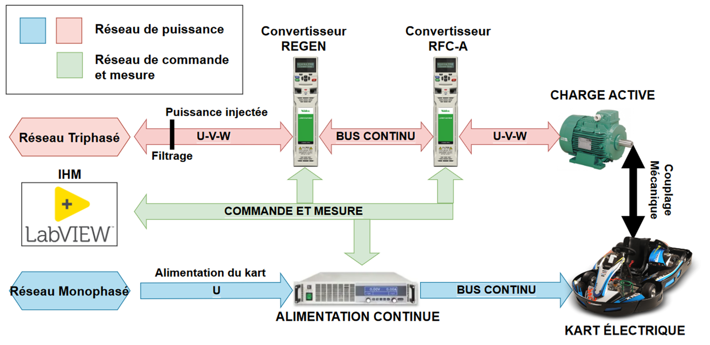
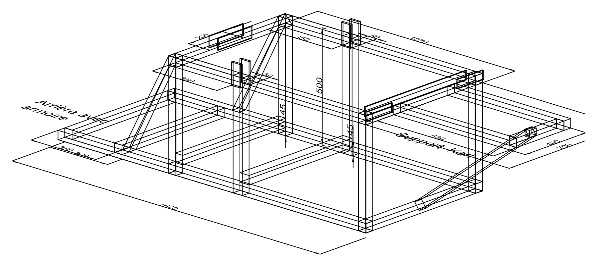
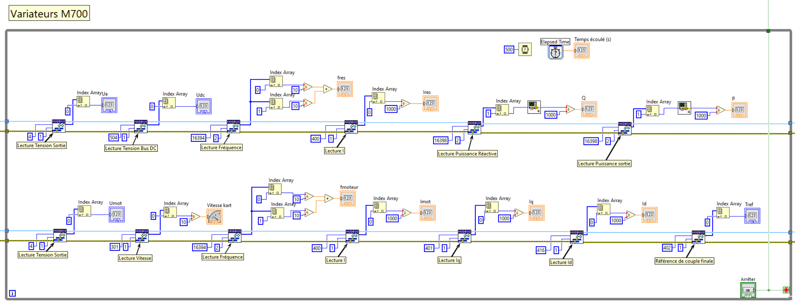

## Objectif du projet
Les projets universitaires dans la formation GEII sont proposés sur la formation initiale afin d'apporter, en plus des stages, un aspect professionnalisant et un ensemble de compétences. Parmi ces compétences, on retrouve spécialement la gestion de projet et le travail d'équipe. L'objectif de ces projets est également de fournir un livrable aux clients pouvant être aussi bien la structure de l'IUT que des entreprises partenaires.

Le projet de banc de test de kart électrique doit répondre à un besoin de la formation GEII de l'IUT de l'Indre. En effet, les nouveautés technologiques doivent être suivies afin d'adapter au mieux la formation au monde du travail. Les enjeux de maitrise énergétique en sont tout aussi importants, surtout dans la spécialité Électricité et Maitrise de l'Énergie du BUT GEII. Afin d'être dans cette continuité de logique de développement durable, ce projet doit revaloriser l'acquisition du kart électrique, acheté par la formation, il y a une dizaine d'années, pour un projet universitaire. 

Pour cela, la conception d'une maquette de formation sous la forme d'un banc de test a été proposée. Elle devra intégrer des techniques d'asservissement de couple par des variateurs, ainsi que l'injection de l'énergie de freinage sur le réseau. Cette énergie était auparavant dissipée dans des résistances de freinages. C'est le même principe du freinage régénératif des voitures hybrides. Dans un contexte industriel, sur de plus larges machines, la réduction du cout est non négligeable. L'objectif est de présenter cet aspect aux étudiants grâce à cette maquette.

Ce projet est réalisé sur les deux années BAC+2 et BAC+3 de BUT GEII avec 5 étudiants : Nathan Giguelay, Axel Laboute, Corentin Da Silva, Lyse Dorianne Itoua-Poto et Redwan Benmansour. Nos tuteurs sont M. Pascal Rebeix et M. Jean-Marc Roussel.

## Principe de fonctionnement
Le banc de test consiste à coupler mécaniquement un moteur au kart afin d'imposer une charge active. L'objectif est de pouvoir simuler des scénarios de montée sur celui-ci. D'un point de vue éducatif, cela permet d'à la fois aborder l'aspect électrotechnique, mais aussi celui de gestion de l'énergie et d'injection réseau. La synoptique de principe est la suivante :

*Synoptique de principe.*

Le kart électrique sera alimenté par un convertisseur monophasé AC vers DC. Celui-ci était avant alimenté par des batteries nécessitant une maintenance continue et couteuse. 

L'arbre moteur du kart sera couplé à la charge active qui sera un moteur asynchrone à contrôle vectoriel de flux. Ce moteur sera commandé en couple par une structure de doubles convertisseurs DC/AC (variateurs de vitesse) montés en tête-bêche. L'objectif est également de présenter la commande vectorielle avec cette maquette et les variateurs

Un convertisseur gérera la commande en couple et le flux moteur, l'autre gérera l'injection en triphasé au réseau. Une attention particulière sera portée sur le filtrage des harmoniques causées par l'onduleur. On peut imaginer l'utilisation d'un oscilloscope en amont et en aval des filtres afin de comparer le THD et de déterminer l'efficacité des filtres.

Une IHM basée sur LabVIEW permettra de piloter et de superviser les variateurs et l'alimentation. Celle-ci permettra de récupérer les grandeurs et courbes en temps réel sur le banc de test.

## Étapes du projet
Le travail à été séparé durant les trois phases de cours en formation initiale (les projets étant exclusifs aux étudiants initiaux). Ces phases sont les suivantes :
### Phase 1 : Étude et conception S41 S42 

**Étude Électrique**
- Schéma électrique : Conception de l’ensemble des schémas électriques
- Dimensionnement des Composants : Sélection des protections, variateurs et câblage.
- Commande et Approvisionnement : Demande de devis et validation auprès des fournisseurs.
- Étude du paramétrage des variateurs

**Étude Mécanique**
- Mesures : Prise de mesures du kart et des pièces mécaniques
- Conception mécanique : CAO et DAO de la structure mécanique du banc
- Dimensionnement de l’accouplement du moteur asynchrone charge active avec l’arbre du kart (respect du rapport de réduction)

### Phase 2 : Installation et paramétrage S43 S50

**Paramétrage des Variateurs**
- Paramétrage : Configuration de la commande en couple et mode régénération.
- Communication : Étude des échanges de données entre variateurs et IHM.

**Développement de l’IHM LabVIEW**
- Création de l’interface : Supervision et acquisition de données en temps réel des variateurs, données de vitesse, de couple, de tension, de fréquence, de courant et de puissance.
- Ajout de sécurités supplémentaires en commande

**Étude des communications avec LabVIEW**
- Étude de la communication des variateurs de la charge active : Contrôle des modes de fonctionnement, commande en couple du moteur asynchrone de simulation de freinage.
- Étude de la communication de l’alimentation programmable du variateur du kart électrique : Ajustement des paramètres de tension et courant et supervision des données.

**Installation**
- Assemblage de la Structure : Montage de la plateforme et intégration des composants mécaniques.
- Positionnement, câblage, et connexion des équipements.

### Phase 3 : Mise en route et vérification S51 S2

**Mise en Route**
- Mise en route et vérification mécanique et électrique.
- Production des documentations et des procédures.

## Avancement du projet : Décembre 2024 (Début S50)
Les premières étapes de conception ont duré quelques semaines en octobre et ont fini par la commande du matériel nécessaire. Ces étapes étaient :
- La rédaction du cahier des charges
- La CAO/DAO d'un chassis pour supporter le kart et le moteur
- La CAO/DAO des schémas électriques

*Schéma de conception du chassis du banc de test.*

En attendant la récéption, nous avons pu avancer sur :
- La rédaction d'un rapport de projet
- Le dévloppement de l'IHM sur LabVIEW
- Le pré-paramétrage des variateurs sur LabVIEW

*Dévloppement de l'IHM LabVIEW avec la supervision des deux variateurs.*

Nous avons reçu la semaine dernière le châssis et l'intégralité des composants électriques avec l'armoire. Viennent s'ajouter l'alimentation, le moteur et les variateurs. Tout le matériel est présent pour commencer l'installation. L'objectif pour les prochaines semaines est le travail suivant :
- L'assemblage de la structure avec le kart et le moteur
- Le câlage de l'armoire
- Le paramétrage variateur/IHM 
- La mise en route avec le client et résolution des problèmes
- La rédaction du rapport et des documentations

Le projet devra être livré pour mi-janvier 2025. Une deuxième partie avec la publication du rapport permettra plus de détails sur l'aspect technique :)