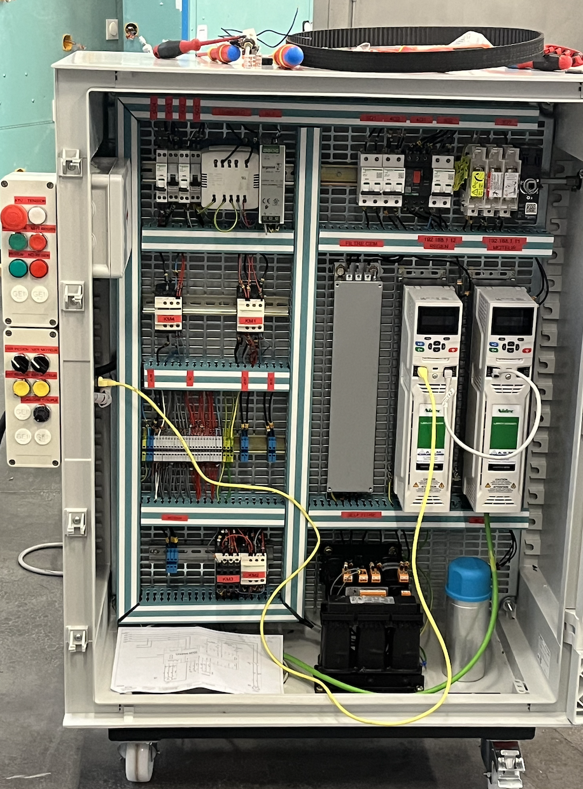
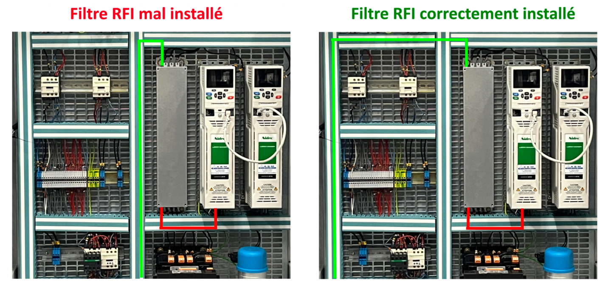

Ce post est la deuxième partie d'une série sur notre projet universitaire de banc de test pour un kart électrique. Il est recommandé d'avoir lu la première partie avant de lire celle ci :

https://redwanbnmnsr.github.io/fr/projects/kart_test_bench/

Les informations ici sont résumées et vulgarisées. Pour plus de détails, vous trouverez la publication de notre rapport de projet en bas de page.

# Instllation 
## Câblage
Une fois les schémas électriques validés par nos tuteurs, et les commandes reçues, nous pouvons commencer à l'étape du câblage. Cette étape est très importante et doit être faite avec rigeur et concentration. N'importe quelle erreur pourra mener à des dommages irreversibles des appareils. Pour éviter cela, tous les fils sont numérotés conformément au schéma, puis vérifiés par deux personnes différentes. De cette manière, nous avons fini l'armoire en une semaine avec un câblage avec très peu d'erreurs. 

*Armoire électrique*

La principale contrainte à prendre en compte lors du câblage de l'amrmoire est la compatibilité électromagnétique ou CEM. Du fait de l'utilisation d'un variateur régénératif, nous devons respecter des règles permettant d'éviter la pollution du réseau et des appareils annexes par des harmoniques. En effet, un variateur régénératif cause une pollution harmonique importante du fait de son découpage à haute fréquence. Lorsque des fils sont proches physiquement, un fil non pollué est capable de capter une pollution harmonique, c'est ce qu'on appelle un couplage par rayonnement. Pour cela, tous les fils provennant d'un circuit pollué doivent partager un espace différent des fils provennants d'un circuit non pollué. Le circuit en ammont du filtre CEM est considéré comme non pollué, le circuit en aval est considéré comme pollué. Le câblage doit donc être comme suit :

*Câblage du filtre CEM*

## Structure mécanique
La structure métalique nous est arrivée conformément aux dessins que nous avions envoyé au fournisseur. L'obbjectif est d'y placer l'amoire, l'alimentation, le moteur et le kart. La structure a correctement été dimensionnée et nous n'avons pas eu de problèmes lors de la fixation.

*Armoire et kart fixés*

La principale difficulté résidait dans le couplage entre le kart et le moteur servant de charge active. Pour simplifier, nous avons dans un premier temps fixé le kart et le moteur, puis nous avons commandé la courroire de taille idéale pour le couplage. Après quelques ajustements, la courroie était correctement fixée. Nous y avons ajouté ensuite une enceinte de protection afin de sécuriser le banc de test.

*Couplage en le kart et l'armoire*

# Mise en route
## Paramétrage des variateurs
Les variateurs Unidrives M700 sont polyvalents mais nécéssitent un certain paramétrage avant leur fonctionnement. Nous avons fait la liste des paramètres à modifier pour chaque variateur, cette liste est disponible dans le rapport, ainsi qu'une synoptique du fonctionnement des variateurs. Les groupes de paramètres à modifier sont les suivants :

Variateur régénératif :
- Mode du variateur (Régénératif)
- Les paramètres de communication

Variateur du moteur :
- Mode du variateur (Machine Asynchrone à commande vectorielle de flux)
- La plaque signalétique du moteur
- Les valeurs limites de sécurité
- Les paramètres de régulation
- Les paramètres de communication

Seul les paramètres de communication doivent être entrés par le clavier des variateurs, le reste des paramètres peut être réglé avec le logiciel Nidec Connect. Il reste ensuite le calibrage des paramètres de la boucle régulation. Le plus simple et le plus précis consiste à utiliser la fonction d'autocalibrage. Le moteur tourne alors pendant un certain temps afin que le variateur définisse les meilleurs paramètres de régulation.

## Mode manuel

Une fois les variateurs paramétrés, nous pouvons désormais essayer la maquette. L'objectif est de faire rouler le kart à vitesse maximale, puis de le freiner avec la charge active commandée par le potentiomètre. Une courte vidéo permet d'observer ce fonctionnement :

## IHM

L'autre mode de fonctionnement est celui de l'IHM. Celle-ci est programmée sur LabVIEW et doit permettre de commander et de superviser l'alimentation et les variateurs. À terme, l'IHM devra aussi fournir une solution de simulation de pente et de charge afin d'adapter de couple de la charge active en fonction de paramètres fictifs. 

L'alimentation a été livrée avec une librairie de blocs LabVIEW. Son intégration a donc été facile et rapide. Les opérations de lecture et d'écritue sur les variateurs sont faites en Modbus TCP. Nous avons ensuite développé notre propre librairie pour les variateurs afin de faciliter l'écriture de l'IHM.

# Rapport de projet

Disponible le 20/02/2025