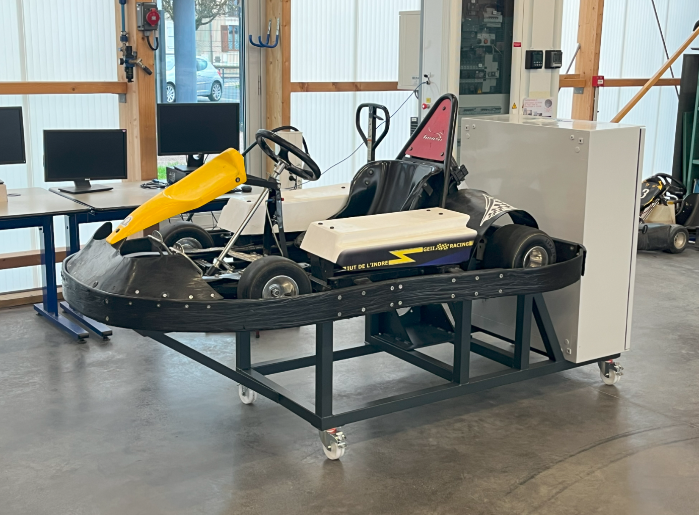
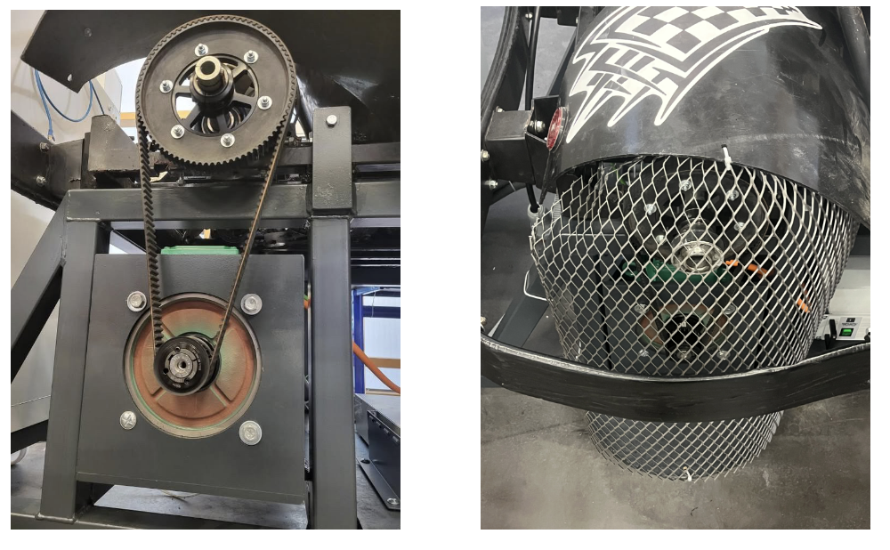
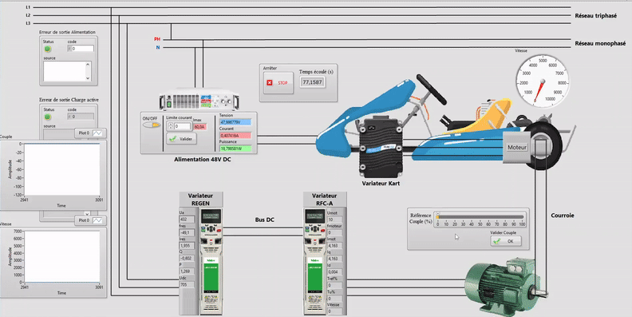

Cet article est la deuxième partie d'une série sur notre projet universitaire de banc de test pour un kart électrique. Il est recommandé d'avoir lu la première partie avant de lire celle-ci :

https://redwanbnmnsr.github.io/fr/projects/kart_test_bench/

Les informations de cet article sont simplifiées et vulgarisées. Le rapport de projet complet est disponible [en bas de page](#rapport-de-projet).

# Installation 
## Câblage
Une fois les schémas électriques validés par nos tuteurs, et les commandes reçues, nous pouvons commencer l'étape du câblage. Cette étape est très importante et doit être faite avec rigueur et concentration. N'importe quelle erreur pourra mener à des dommages irréversibles des appareils. Pour éviter cela, tous les fils sont numérotés conformément au schéma, puis vérifiés par deux personnes différentes. De cette manière, nous avons fini l'armoire en une semaine avec un câblage avec très peu d'erreurs. 


*Armoire électrique*

La principale contrainte à prendre en compte lors du câblage de l'armoire est la compatibilité électromagnétique ou CEM. Du fait de l'utilisation d'un variateur régénératif, nous devons respecter des règles permettant d'éviter la pollution du réseau et des appareils annexes par des harmoniques. En effet, un variateur régénératif cause une pollution harmonique importante du fait de son découpage à haute fréquence. Cette pollution doit être alors filtrée à la sortie du variateur régénératif, mais ce n'est pas toujours suffisant.

Lorsque des fils sont proches physiquement, un fil non pollué est capable de "capter" une pollution harmonique, c'est ce qu'on appelle un couplage par rayonnement. Pour éviter le couplage par rayonnement, tous les fils provenant d'un circuit pollué doivent partager un espace différent des fils provenant d'un circuit non pollué. Une logique d'implémentation a dû être mise en œuvre avant le câblage.

## Structure mécanique
La structure métallique nous a été livrée conformément aux dessins que nous avions envoyés au fournisseur. L'objectif est d'y placer l'armoire, l'alimentation, le moteur et le kart. La structure a correctement été dimensionnée et nous n'avons pas eu de problèmes lors de la fixation.

*Armoire et kart fixés*

La principale difficulté résidait dans le couplage entre le kart et le moteur servant de charge active. Pour simplifier, nous avons dans un premier temps fixé le kart et le moteur, puis nous avons commandé la courroie de taille idéale pour le couplage. Après quelques ajustements, la courroie était correctement fixée. Nous y avons ajouté ensuite une enceinte de protection afin de sécuriser le banc de test.

*Couplage entre le kart et l'armoire*

# Mise en route
## Paramétrage des variateurs
Les variateurs Nidec Unidrives M700 sont très polyvalents et nécessitent donc un certain paramétrage avant leur fonctionnement. Les groupes principaux de paramètres à modifier sont les suivants :

**Variateur régénératif :**
- Mode du variateur (Régénératif)
- Paramètres de communication

**Variateur du moteur :**
- Mode du variateur (Machine Asynchrone à commande vectorielle de flux)
- Plaque signalétique du moteur
- Valeurs limites de sécurité
- Paramètres de régulation (Régulation de couple)
- Paramètres de communication

Seuls les paramètres de communication doivent être entrés manuellement par le clavier des variateurs, le reste des paramètres peut être réglé avec le logiciel Nidec Connect. Il reste ensuite le calibrage des paramètres de la boucle de régulation. Le plus simple et le plus précis consiste à utiliser la fonction d'autocalibrage. Le moteur tourne alors pendant un certain temps afin que le variateur définisse les meilleurs paramètres de régulation.

Deux modes de commande seront disponibles, un mode manuel en utilisant le potentiomètre sur la boîte à boutons afin de choisir une consigne de couple (Pourcentage du couple nominal du moteur), et un mode IHM désactivant le potentiomètre et permettant la commande depuis l'IHM. 

La liste des paramètres à modifier ainsi qu'une synoptique du fonctionnement des variateurs est disponible dans le rapport. 

## Essai en mode manuel

Une fois les variateurs paramétrés, nous pouvons désormais essayer la maquette. L'objectif est de faire rouler le kart à vitesse maximale, puis de le freiner avec la charge active commandée par le potentiomètre. Une courte vidéo permet d'observer ce fonctionnement :

## Essai en mode IHM

L'autre mode de fonctionnement est celui de l'IHM. Celle-ci est programmée sur LabVIEW et doit permettre de commander et de superviser l'alimentation et les variateurs. À terme, l'IHM devra aussi fournir une solution de simulation de pente et de charge afin d'adapter le couple de la charge active en fonction de paramètres fictifs. 

L'alimentation a été livrée avec une librairie de blocs LabVIEW. Son intégration a donc été facile et rapide. La communication avec les variateurs est faite en Modbus TCP. Ce protocole permet d'accéder directement aux paramètres voulus. La principale difficulté est que le Modbus utilise des trames 16 bits alors que les données du variateur sont codées en 32 bits. Nous avons donc développé notre propre librairie de conversion spécifiquement pour les variateurs M700 en Modbus TCP.

La première version de l'IHM retenue est la suivante. On observe en bas à gauche l'accélération du kart, puis en réglant la consigne de couple résistant sur la commande de droite, on observe que le kart ralentit.

*IHM du banc en fonctionnement*

# La suite ?

Ce projet est une réussite et nous avons pu accomplir les objectifs principaux. Certains objectifs n'ont pas été atteints et malgré la frustration nous n'aurons pas le temps d'y travailler à nouveau puisque nous partons en stage et pour certains à l'étranger.

Malgré tout, nous souhaitons valoriser notre travail en participant au concours "Mon projet en 5 min" du club EEA. Ce concours consiste en une présentation en 5 min d'un projet par une vidéo, puis après sélection, une présentation devant un jury. La vidéo est en cours de montage et sera bientôt prête. Nous espérons être qualifiés pour la finale !

# Rapport de projet

Le rapport de projet est disponible sur le lien suivant :

