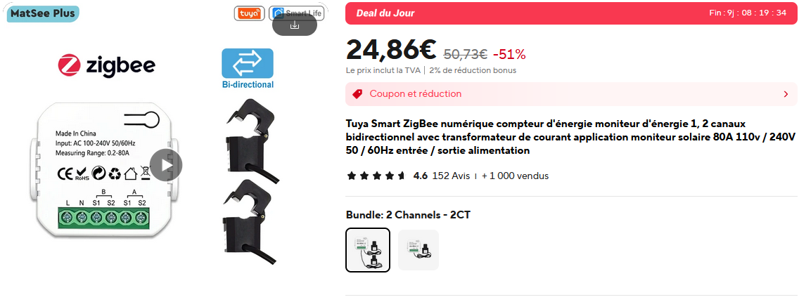

## Home Assistant, un indispensable de la domotique ?
Depuis quelques années, Home Assistant s'est réellement imposé parmi les environnements domotiques. Son efficacité, sa compatibilité et son énorme communauté la propulsé devant d'autres solutions open source comme Jeedom. 

Ayant essayé Home Assistant il y a quelques mois maintenant, je me suis rendu compte que l'intégralité de mon installation domotique était compatible, mais également que de nouveaux appareils pouvaient y être intégrés. Il me restait plus qu'à configurer une solution propre et durable au sein de Home Assistant.

La plupart des utilisateurs préconisent les appareils légers tels que la Raspberry Pi à partir du modèle 3 pour faire tourner le serveur domotique. Cependant, dans mon cas, j'ai pensé à une solution encore plus simple : et si je le faisais tourner sur ma box internet ? 

La Freebox ultra est la nouvelle box de free équipée du SoC Qualcomm IPQ 9574, donc quatre cœurs ARM Cortex-A73 cadencés à 2.2GHz, ce qui la place entre la Raspberry Pi 4 et 5 en termes de performance. Elle supporte les VM (machines virtuelles) et les périphériques USB, ce qui est très utile pour les appareils Zigbee. Il me suffit de brancher une clé Zigbee et de lancer la VM pour piloter tous mes appareils : climatiseurs, capteurs, éclairages...


*La fenêtre des VM Freebox.*

## Monitoring de la consommation électrique
### Installation du compteur Zigbee
Un atout considérable de Home Assistant est la gestion des consommations énergétiques et des installations solaires. À partir de quelques données, il est possible d'établir tout un dashboard de monitoring (voir https://www.home-assistant.io/home-energy-management/ ). Dans un premier temps, je souhaite me focaliser sur la consommation électrique. Pour cela, j'ai trois solutions :

 - Utilisation du compteur Linky (compteur communiquant du distributeur Enedis) par l'intermédiaire de l'API Enedis (Cloud, voir https://github.com/bokub/ha-linky )
 - Utilisation du compteur Linky local à l'aide d'un module TIC
 - Installation d'un compteur Zigbee supplémentaire

 J'ai retenu la dernière solution, car elle me paraissait la moins chère, mais me permettait également de comparer les données avec celles du cloud Linky. Un simple appareil Zigbee obtenable sur AliExpress pour une vingtaine d'euros suffirait amplement. 


*À ce prix-là je n'attends pas grand-chose... Mais je vais être agréablement surpris !*

Celui-ci est calibré pour 80 A maximum, ce qui est largement suffisant. Il dispose de deux transformateurs (capteurs de courant) pour deux canaux, ce qui me permettra de différencier mes deux tableaux électriques. Son installation est simple, il suffit de le brancher au réseau et de boucler les deux sondes de courant (voir photo ci-dessous) :


*Le rouge sur le rouge et le bleu sur le bleu.*

Le capteur s'allume avec les deux sondes bien installées. L'appareillage se fait simplement et il me suffit maintenant de le configurer.

### Configuration Home Assistant
Premièrement, l'appareil n'est pas entièrement plug and play, les données sont présentes mais brutes et non formatées. Heureusement, la communauté Home Assistant est assez grande pour avoir produit un quirk ZHA, qui est simplement un fichier de formatage pour Zigbee Home Assistant (voir https://forum.hacf.fr/t/zigbee2mqtt-et-probleme-avec-compteur-energie-tuya-zigbee/29847 ). Une fois le fichier intégré, on retrouve nos données de consommation :


*Mais que vais-je faire de toutes ces données !*

Il ne reste plus qu'à utiliser les templates d'intégration mathématique pour passer d'une puissance instantanée à une consommation en kWh (voir https://www.home-assistant.io/integrations/integration/ ). Cette consommation peut être directement intégrée à l'onglet Énergie de Home Assistant :


*C'est génial, non ?*

Ces données correspondent au capteur Zigbee, le taux d'énergie décarbonée est directement récupéré de l'API d'Electricity Maps (super site à voir ici : https://app.electricitymaps.com/map ).

Pour m'amuser, j'ai également intégré les données du cloud Linky pour comparer les consommations, et les résultats sont assez surprenants :


*Forcément, c'est le Linky qui surestime...*

Premièrement, le capteur Zigbee est très proche du capteur Linky malgré son faible prix ! Par ailleurs, les écarts sont quasi constants, ce qui fait penser à une consommation en amont non prise en compte. On serait sur une consommation environ de 25 Wh, le compteur Linky à une consommation entre 2 et 10W et serait le seul appareil en amont. Cet écart est alors une erreur de calibrage du capteur en offset (constant), soit un appareil non identifié dans mon installation électrique. Le mystère reste à ce jour non résolu... (gros doutes sur ce capteur tout de même).


## Monitoring de la consomation d'eau
### Comment faire ?
Le monitoring de la consommation électrique est simple et non intrusif. Aucun câblage n'a dû être modifié. Le monitoring de la consommation de l'eau est beaucoup plus compliqué. Bien qu'il existe des appareils le permettant, il est indispensable de modifier la tuyauterie, et mes compétences de plomberie sont quasi nulles. Le même problème réside pour le monitoring de la consommation du gaz.

Alors, il existe des compteurs communicants comme le Linky. Il est soit possible d'installer un mod comme le module TIC, ou soit d'utiliser directement l'API cloud des fournisseurs. Cependant, j'ai trouvé une solution encore plus simple pour mon cas de figure, et cela part de la découverte d'un réseau Wi-Fi bien étrange...

### Un réseau WI-FI bien étrange...
En me baladant sur les plages et les canaux Zigbee (qui ne fait pas ça ?), j'ai remarqué un réseau bien étrange. Il s'appelait BWT@7642 et se trouvait particulièrement proche. Une recherche Google m'indique que BWT est un constructeur de produits de traitement de l'eau ; je fais le lien immédiatement avec mon adoucisseur. Celui-ci est bien de la marque BWT mais que fait un réseau Wi-Fi sur cette machine ? 

BWT propose des solutions d'adoucisseurs domotiques pilotables, le mien n'en est pas un. Alors à quoi peut bien servir un réseau Wi-Fi (et Bluetooth par ailleurs) sur un adoucisseur. Je me connecte et je tombe sur cette page :


*Page d'accueil de l'adoucisseur.*

J'ai un certain nombre d'informations de maintenance, ce qui va m'être très utile. Allons voir comment sont gérées les requêtes sur ces informations :


*Doucement sur les requêtes, quand même.*

Toutes les secondes, un script envoie une requête get vers un lien (http://192.168.1.72/cgi-bin/getinfo1) et l'appareil retourne une chaine JSON :

```json
{
  "remRege":2000,
  "remCapa":42,
  "remSalt":7000,
  "waterCons":645,
  "waterRege":0,
  "alarme":0,
  "etat":0,
  "error":0
}
```
On remarque qu'il y a plus d'informations que sur la page, notamment la consommation d'eau. Sachant que toute l'eau passe par l'adoucisseur, on aura une information directe sur la consommation d'eau au domicile.

Par ailleurs, cette donnée s'agit bien du volume total et non du débit actuel. Pour faire l'analogie, sur la consommation électrique, on avait la puissance instantanée et non l'énergie consommée. Cela permettra, cette fois-ci, de l'intégrer plus facilement à l'onglet énergie de Home Assistant.

### Configuration Home Assistant

Sachant qu'on a une chaine JSON sur une adresse, il nous suffit d'avoir une intégration Home Assistant permettant de faire des requêtes HTTP. Elle existe et s'appelle RESTful, basée sur l'API REpresentational State Transfer ou REST, qui permet la communication de données entre machines. Voici ma configuration YAML :
```yaml
rest:
  - authentication: basic
    scan_interval: 10
    resource: http://192.168.1.72/cgi-bin/getinfo1
    sensor:
      - name: "Remaining Rege"
        json_attributes_path: "$"
        value_template: '{{ value_json.remRege }}'
        unit_of_measurement: "g"
        state_class: "measurement"
        device_class: "weight"
        json_attributes:
          - remRege
      - name: "Remaining Capacity"
        json_attributes_path: "$"
        value_template: '{{ value_json.remCapa }}'
        unit_of_measurement: "kg"
        state_class: "measurement"
        device_class: "weight"
        json_attributes:
          - remCapa
      - name: "Remaining Salt"
        json_attributes_path: "$"
        value_template: '{{ value_json.remSalt }}'
        unit_of_measurement: "g"
        state_class: "measurement"
        device_class: "weight"
        json_attributes:
          - remSalt
      - name: "Water Consumption 2"
        json_attributes_path: "$"
        value_template: '{{ value_json.waterCons }}'
        unit_of_measurement: "L"
        state_class: "total_increasing"
        device_class: "water"
        json_attributes:
          - waterCons
      - name: "State"
        json_attributes_path: "$"
        value_template: '{{ value_json.etat }}'
        state_class: "measurement"
        json_attributes:
          - etat
      - name: "Error"
        json_attributes_path: "$"
        value_template: '{{ value_json.error }}'
        state_class: "measurement"
        json_attributes:
          - error
      - name: "Water Regeneration"
        json_attributes_path: "$"
        value_template: '{{ value_json.waterRege }}'
        state_class: "measurement"
        json_attributes:
          - waterRege
      - name: "Alarm"
        json_attributes_path: "$"
        value_template: '{{ value_json.alarme }}'
        state_class: "measurement"
        json_attributes:
          - alarme
```

À chaque fois, on vient attribuer un capteur à un attribut JSON, en précisant la nature du capteur, sa classe et son unité. Cela permet de directement intégrer le capteur sur l'onglet énergie de Home Assistant :


*Avec la douche, ça monte très vite !*

Les autres capteurs paramétrés me permettront d'obtenir des informations sur le sel restant et les potentiels problèmes liés à l'adoucisseur.

## Dashboard de monitoring
Utilisant Home Assistant pour le contrôle de mes appareils domotiques, je dispose déjà d'un dashboard. Il me reste plus qu'à intégrer la partie consommation à celui-ci.


*Sympa, non ?*

Dans ce dashboard, on doit retrouver les consommations (eau et électricité) sur la journée et les consommations instantanées. Comme on l'a vu plus tôt, il est assez facile de passer de la valeur instantanée à la valeur totale et vice-versa, à l'aide des opérateurs mathématiques de dérivation et d'intégration de Home Assistant.

Pour la consommation journalière, je vais simplement réutiliser les cartes de l'onglet énergie de Home Assistant (voir https://www.home-assistant.io/dashboards/energy/ ). Pour la consommation instantanée, une carte personnalisée sera utilisée (voir https://github.com/flixlix/power-flow-card-plus ). Après quelques minutes de configuration, j'arrive à ce résultat :


*1.2 kW ?! Je crois que le four est allumé.*

On a bien les consommations instantanées et même divisées pour les deux tableaux, les consommations par jour et les histogrammes par heures.

## La suite ?
Ce dashboard de monitoring des consommations nous a permis d'identifier les consommations des appareils, notamment des appareils en veille, et de mieux nous sensibiliser sur le coût des ressources. Lorsque la consommation électrique est de 300W de base, il y a un réel travail à faire sur le rendement des appareils constamment allumés, je pense particulièrement aux réfrigérateurs et aux VMC.

Il me reste pas mal de travail à faire, spécialement sur l'intégration de l'adoucisseur et des différentes alarmes. Je dois réfléchir à son implémentation dans une interface. Je n'ai également pas parlé de la consommation de gaz. Bien qu'il existe un compteur communicant (Gazpar), il me faudra encore un peu étudier le sujet pour mettre en place une solution concrète et durable.


